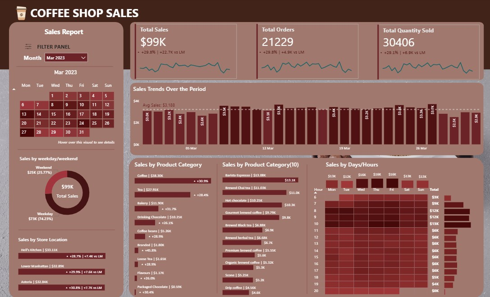
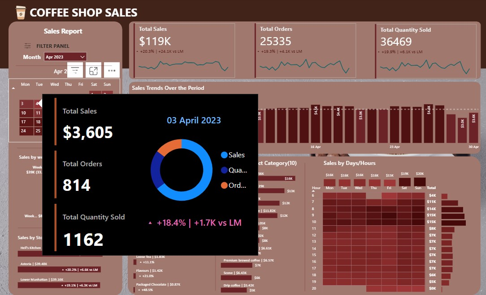

# ☕ Coffee Sales Analysis – SQL + Power BI Dashboard

## Project Overview
This project analyzes coffee sales data using **SQL** for data exploration and **Power BI** for interactive dashboards.  
The goal was to answer key **business questions** related to sales performance, customer behavior, and product trends, and present insights in a visually appealing and actionable way.  

---

## Dataset Description
The dataset used contains sales transactions from a coffee shop, including:
- `transaction_id` – Unique ID for each transaction  
- `transaction_date` – Date of purchase  
- `transaction_time` – Time of purchase  
- `store_location` – Store branch location  
- `product_category` – Product category (e.g., Coffee, Tea, Bakery)  
- `product_type` – Specific product type  
- `unit_price` – Price per unit  
- `transaction_qty` – Quantity purchased  
Time period: Jan 2023 to June 2023
---

## Data Cleaning
Before analysis, the dataset was cleaned:
```sql
-- Convert transaction_date to DATE format
UPDATE coffee_shop_sales
SET transaction_date = STR_TO_DATE(transaction_date, '%d-%m-%Y');

ALTER TABLE coffee_shop_sales
MODIFY COLUMN transaction_date DATE;

-- Convert transaction_time to TIME format
UPDATE coffee_shop_sales
SET transaction_time = STR_TO_DATE(transaction_time, '%H:%i:%s');

ALTER TABLE coffee_shop_sales
MODIFY COLUMN transaction_time TIME;

-- Rename incorrect column name
ALTER TABLE coffee_shop_sales
CHANGE COLUMN transaction_id transaction_id INT;
```
---

## Business Questions / KPIs
The following questions were answered through SQL queries and visualized in Power BI:  
- Monthly Sales Trend

Question: How do sales vary month by month?
Insight: Sales consistently grew from January to June, peaking in June at $166K+ total sales. This shows strong seasonal growth, likely due to summer demand.

- Sales by Store Location

Question: Which store locations perform best?
Insight: Hell’s Kitchen consistently outperformed other locations, leading in 4 out of 6 months.
Astoria and Lower Manhattan showed competitive sales, with Astoria occasionally surpassing Lower Manhattan.

This indicates that Hell’s Kitchen is the strongest market, but demand is healthy across all branches.

- Peak Sales Days & Hours

Question: What are the busiest times for sales?
Insight:
Peak day: Weekdays recorded the highest sales volume every month except the month of April.
Peak hours: Between 8 AM - 10 AM, aligning with morning coffee rush.

This highlights strong commuter-driven demand, suggesting opportunities for promotions in these slots.

- Top Products by Sales

Question: Which products generate the highest revenue?
Insight:
Barista Espresso is the clear leader with $91K+ sales.
Other top performers include Brewed Chai Tea, Hot Chocolate, and Gourmet Brewed Coffee.

This shows a balanced demand for both coffee and non-coffee beverages, useful for menu planning.

- Category-Level Insights

Question: Which product categories dominate sales?
Insight:
Coffee-based products are the biggest contributors, but tea-based beverages (chai & herbal/black teas) also generate significant revenue.
Food items like scones also appear in the top 10 products, showing good cross-selling potential.

- Top Coffee Product in May

Question: What is the best-performing coffee product in a specific month (May)?
Insight:
Barista Espresso again leads in May with $20.4K sales, followed by Gourmet Brewed Coffee ($15.5K).

Seasonal promotions on espresso could further strengthen performance during peak months.

---

## SQL Analysis
All SQL queries used to explore and answer the above questions are available in [`sql_queries/`](./sql_queries).  

Each query focused on:  
- Aggregating **total sales & orders**.  
- Identifying **top 10 best-selling products**.  
- Analyzing **weekday vs weekend performance**.  
- Calculating **Monthly growth**.  

>  Example: To analyze weekday vs weekend sales, a `CASE WHEN` condition was applied on the transaction date to group sales accordingly.  

---

## Power BI Dashboard
An interactive Power BI dashboard was created to visualize and explore the insights:  

### Key Visuals
- **Sales Calendar Heatmap** – Sales trends across Days and Hours.  
- **Sales by Weekdays** – Donut chart showing weekday vs weekend patterns.  
- **Sales by Store Location** – Bar chart comparing store performance.  
- **Top 10 Products** – Bar chart ranking best-selling products.  
- **Monthly Sales & Monthly Growth** – Line chart to observe growth patterns. 

*Dashboard Preview:*  
  
 

---

## How to Run This Project
1. Clone the repository:
   ```bash
   git clone https://github.com/your-username/coffee-sales-analysis.git
   ```
2. Import the dataset into your SQL environment (MySQL/Postgres).
3. Run queries from sql_queries/
4. Open the Power BI file (Coffee_Sales_Dashboard.pbix) to explore the dashboard.
---
## Conclusion

This project demonstrates how SQL + Power BI can be combined to analyze sales data and deliver actionable insights for decision-making.
The findings can help coffee shop owners optimize store operations, inventory planning, and marketing strategies based on customer behavior.

## Repository Structure
```graphql
coffee-sales-analysis/
│── data/                 # Dataset
│── sql_queries/          # All SQL query scripts
│── images/               # Dashboard screenshots
│── coffee_shop_sales_dashboard.pbit   # Power BI file
│── README.md             # Project documentation
```
## Tools & Technologies

- MySQL (Workbench)
- Power BI
- GitHub

## Author
Nasrat Jahan | nasratjahan166@gmail.com | https://www.linkedin.com/in/nasrat-jahan-95aa76326/
